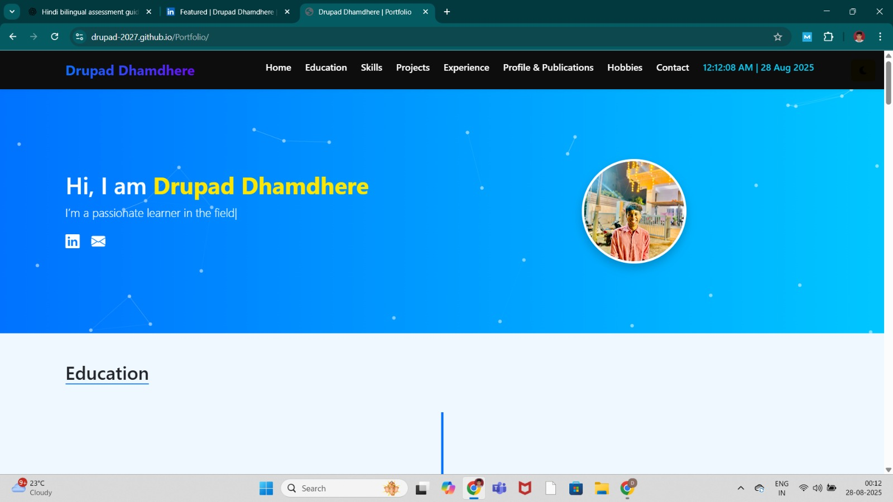

# 🌐 Personal Portfolio - Drupad Dhamdhere

🚀 Welcome to my personal portfolio website!  
This project showcases my journey as an **IT student, aspiring Full Stack Developer, and tech enthusiast**.  

🔗 **Live Portfolio:** [View Here](https://drupad-2027.github.io/Portfolio/)

---

## 📖 About the Project
This portfolio highlights:
- My **education** and career journey
- **Technical skills** in web development, databases, and programming
- **Projects** I have worked on (academic + personal)
- **Certifications** I have earned
- Contact information & links to connect with me

It is designed to reflect both my **technical expertise** and my **personal side** (national-level swimmer & fitness enthusiast 🏊‍♂️💻).

---

## 🛠️ Tech Stack
The portfolio is built with:
- **HTML5**  
- **CSS3**  
- **JavaScript**  
- **Bootstrap**  

---

## 📸 Preview
  

---

## ✨ Features
- Responsive and mobile-friendly design 📱  
- Showcases projects and certifications 🎓  
- Easy navigation between sections 🔗  
- Interactive UI for a better user experience  

---

## 🚀 Future Improvements
- Add a **blog section** (Medium/Dev.to integration)  
- Implement **dark mode toggle** 🌙  

---

## 📬 Contact
📧 Email: **dhamdheredrupad@gmail.com**  
🔗 LinkedIn: [Drupad Dhamdhere](https://www.linkedin.com/in/drupad-dhamdhere/)  
🌐 Portfolio: [Portfolio Website](https://drupad-2027.github.io/Portfolio/)  

---

⭐ If you like this project, don’t forget to **star this repo** and connect with me!  
